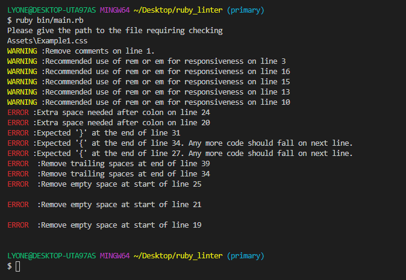

# Build my own ruby_linter Project

- In this project, I have emulated the purpose of a linter file in checking for errors in code syntax and flow.
- The program identifies the errors and informs the user about required correction from the terminal.

## Built with
- Ruby Language
- CSS for the checked file.

## How to run it
- Have ruby installed locally in your machine
- Clone the repository into your local machine from the terminal of your text editor e.g. VS Code
- The project should open its folders and files in your editor window.
- Install ruby colorize gems by running `gem install colorize`
- To start the linter check, run `ruby bin/main.rb` in your terminal
- Give the path to one of the files in Assets folder and press Enter.
- In this project: the linter checks for offenses in CSS file
      1. Example1.css is a CSS file with errors that will inform user to make corrections.
      2. Example2.css is a clean CSS file that passes all checks.
- You'll see a list of Warnings and Errors of your terminal as pertaining to that file.

## Examples of Implemented checks
  - Comment check: Checks for comment on the file
  - Ending check: Checks that there is no space at the end of line.
  - Space check: Checks for two space indetation on inline code.
  - Opening bracket check: Checks opening { are at the end of rule declaration.
  - Closing bracket check: Checks closing } is on seperate line.
  - Unit check: Checks and recommends use of rem and em instead of px.

### *Comment check*
*Bad code*
 ``
 /* My styles */
.first-nav-bar {
  height: 100px;
}
``
*Accepted code*
``
.first-nav-bar {
  height: 100rem;
}
``

## Author

👤 **Leon**

- GitHub: [@githubhandle](https://github.com/Leon-Mbegera)
- LinkedIn: [LinkedIn](https://www.linkedin.com/in/leon-mbegera-053991174/)

 
## 🤝 Contributing

Contributions, issues, and feature requests are welcome!

Feel free to check the [issues page].

## Show your support

Give a ⭐️ if you like this project!

## Acknowledgments

- Hat tip to Microverse.

## 📝 License 
This is a solo Ruby capstone project as a Microverse Student.
All rights reserved for Leon Mbegera.

